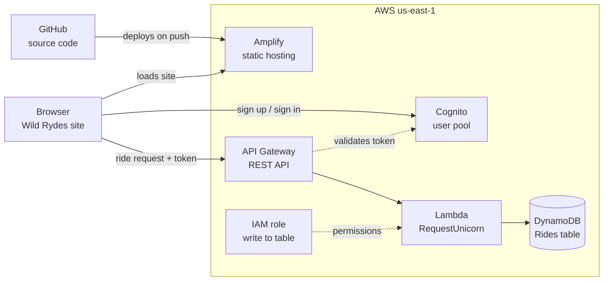
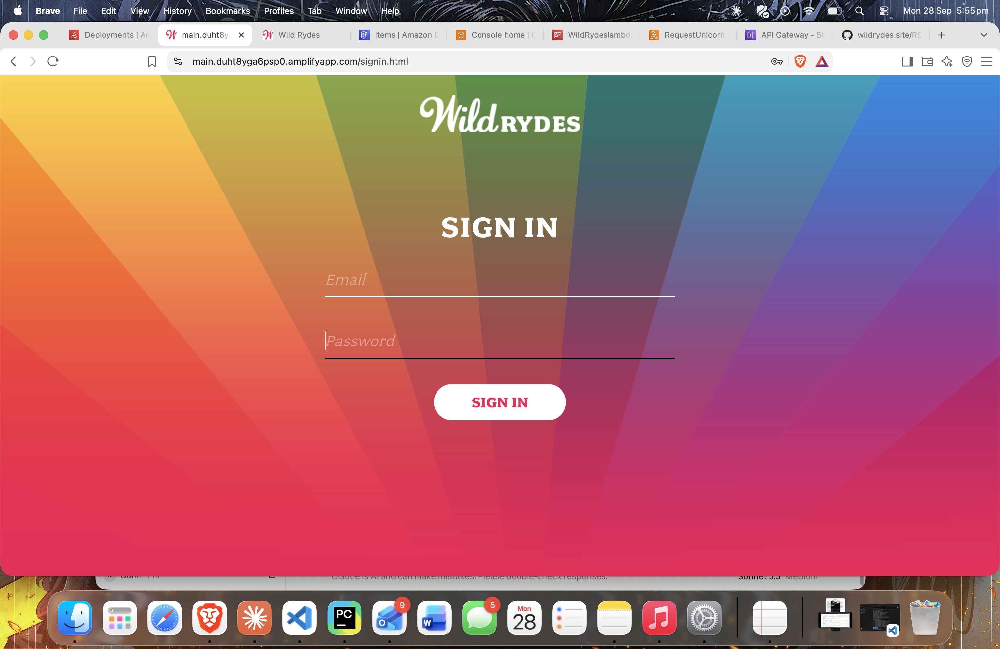
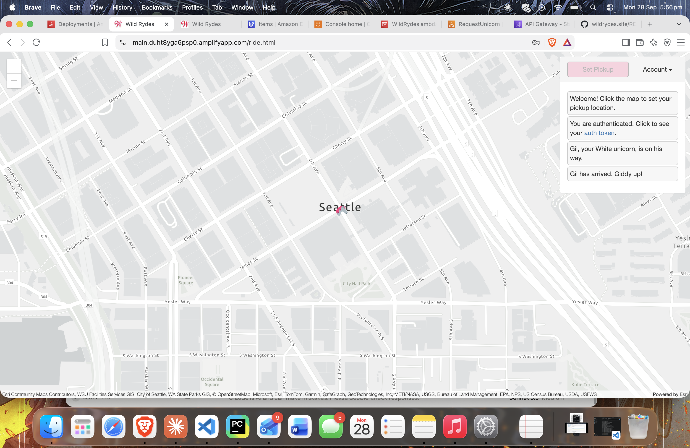
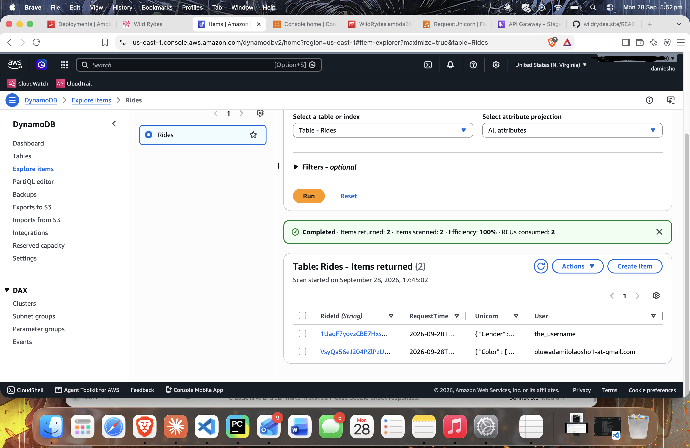

# Wild Rydes: Serverless Ride Booking App on AWS

A full-stack serverless web app where users sign up, log in and request a unicorn ride. Built on AWS from scratch.

**Live demo:** https://main.duht8yga6psp0.amplifyapp.com

## Architecture

- **GitHub + Amplify:** source control and automatic redeploys on every commit
- **Cognito:** user sign-up, email verification and login
- **API Gateway:** REST API secured with a Cognito authorizer
- **Lambda (Node.js 24.x):** backend logic that records each ride request
- **DynamoDB:** stores ride data
- **IAM:** least-privilege role so Lambda can write to the table only

## Screenshots

## Based on the AWS Wild Rydes workshop, with these changes

- GitHub instead of CodeCommit (no longer offered to new AWS customers)
- Amplify Gen 2 and Node.js 24.x
- Deployed in us-east-1

## Problems I solved

- **Empty config error:** the site showed "No Cognito User Pool Configured" because the region value in `config.js` was blank, then malformed. Fixed the syntax and redeployed.
- **Sign-up failing:** the app client had a client secret, which browser apps cannot use. Created a new public SPA app client with no secret.
- **Missing verification email:** confirmed the test user manually in the Cognito console.

## What I learned

Wiring managed auth to a serverless backend, debugging a live deployment, and how IAM permissions connect services securely.

## Run it yourself

1. Create a Cognito user pool and a public app client (no secret)
2. Put your pool ID, client ID and region in `js/config.js`
3. Deploy the API Gateway and Lambda backend, then add the invoke URL to `config.js`
4. Push to GitHub and connect the repo to Amplify
